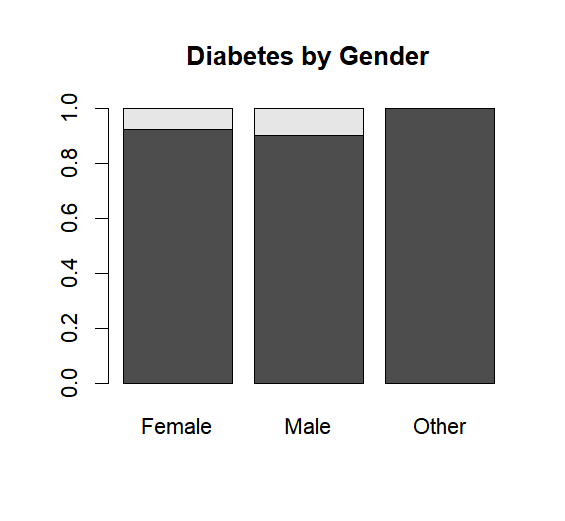
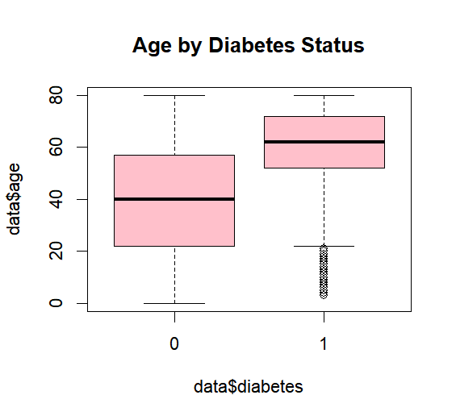
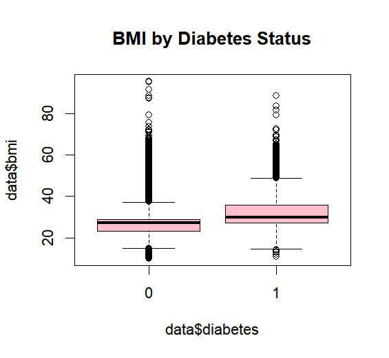
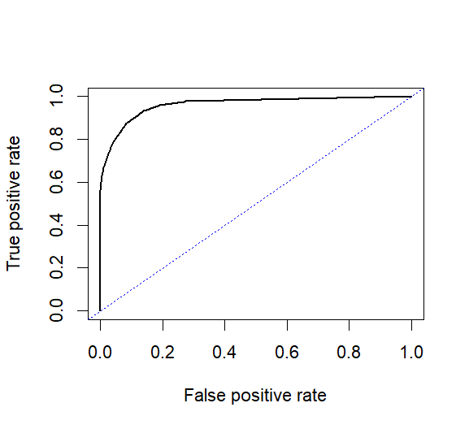
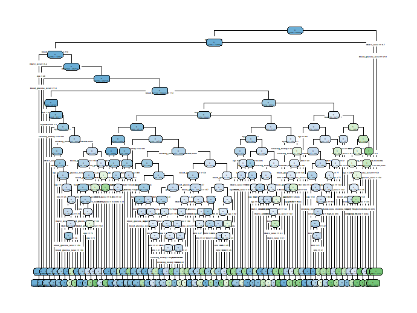

# 🩺 Diabetes Prediction using Machine Learning

A machine learning project for predicting diabetes risk using patient health records. This project compares multiple classification algorithms and investigates how machine learning can support early diabetes screening.

---

## 📖 Overview

This project develops and compares several machine learning models for predicting diabetes using demographic, lifestyle, and clinical health indicators.

The objective is to identify individuals at higher risk of diabetes through data-driven classification, supporting early screening and preventive healthcare.

The study uses a cleaned dataset containing **100,000 patient records** with demographic, lifestyle, and clinical information.

---

## 🎯 Research Motivation

Diabetes is a major global health challenge, and early identification of high-risk individuals can support preventive intervention.

This project investigates:

- Whether machine learning models can accurately predict diabetes risk from patient records.
- Which clinical and lifestyle factors contribute most to diabetes prediction.
- How different classification algorithms perform under an imbalanced dataset.

---

## 🤖 Machine Learning Models

Three classification algorithms were developed and evaluated:

- Logistic Regression
- Decision Tree
- K-Nearest Neighbors (KNN)

Since the dataset is highly imbalanced (**8.5% diabetic vs 91.5% non-diabetic**), this project focuses not only on accuracy but also on **Sensitivity (Recall / True Positive Rate)**, which measures the ability to correctly identify diabetic patients.

---

# 📊 Dataset

The dataset contains approximately **100,000 observations** and **8 predictor variables**.

## Features

| Feature | Description |
|---------|-------------|
| Gender | Patient gender |
| Age | Patient age |
| Hypertension | Whether the patient has hypertension |
| Heart Disease | Whether the patient has heart disease |
| Smoking History | Smoking status |
| BMI | Body Mass Index |
| HbA1c Level | Long-term blood glucose indicator |
| Blood Glucose Level | Current blood glucose measurement |

---

## Target Variable

| Variable | Description |
|----------|-------------|
| Diabetes | 0 = Non-diabetic, 1 = Diabetic |

---

# 🔍 Exploratory Data Analysis

The exploratory analysis reveals several important relationships between patient characteristics and diabetes risk.

| Variable | Observation |
|----------|-------------|
| Age | Older individuals have higher diabetes prevalence. |
| Hypertension | Patients with hypertension show increased diabetes risk. |
| Heart Disease | Positive association with diabetes occurrence. |
| Smoking History | Smoking status is associated with diabetes risk. |
| BMI | Higher BMI corresponds to higher diabetes prevalence. |
| HbA1c Level | Strong predictor related to diabetes status. |
| Blood Glucose Level | One of the strongest predictors with clear class separation. |

---

## Sample Visualizations

### Categorical and Numerical Feature Analysis

<div>
  
  
  
</div>


---

# 🤖 Model Development

Three classification algorithms were trained and evaluated.

| Model | Description |
|------|-------------|
| Logistic Regression | Linear probabilistic classifier |
| Decision Tree | Rule-based non-linear classifier |
| K-Nearest Neighbors (KNN) | Distance-based non-parametric classifier |

---

# ⚙️ Model Training

## Logistic Regression

- All predictors included.
- ROC analysis performed.
- Optimal classification threshold selected at **0.2**.
- AUC = **0.962**.

---

## Decision Tree

Hyperparameter tuning was performed using the Complexity Parameter (cp).

```R
cp_seq <- 10^seq(-6, -1, 1)
```

Best parameter:

```text
cp = 0.0001
```

Performance:

```
AUC = 0.964
```

---

## K-Nearest Neighbors

Numerical variables were standardized before training.

Candidate values:

```R
k = seq(1,401,2)
```

Best parameter:

```text
k = 39
```

Performance:

```
AUC = 0.962
```

---

# 📈 Model Performance

| Model | Accuracy | Sensitivity (TPR) | False Positive Rate | AUC |
|------|---------:|------------------:|-------------------:|----:|
| Logistic Regression | 0.939 | 0.766 | 0.045 | 0.962 |
| Decision Tree | **0.964** | 0.744 | **0.016** | **0.964** |
| KNN (k=39) | 0.943 | **0.791** | 0.043 | 0.962 |

---

# 🏆 Model Comparison Summary

The **Decision Tree** achieved the strongest overall predictive performance, obtaining the highest accuracy (**0.964**) and highest AUC (**0.964**).

However, **K-Nearest Neighbors (KNN)** achieved the highest sensitivity (**0.791**), meaning it identified more diabetic patients correctly.

Therefore:

- Decision Tree is preferred when overall classification performance is the priority.
- KNN may be preferred when minimizing missed diabetes cases is more important.

---

# 📸 Results Visualization

<table>
  <tr>
    <td align="center">
      <br>
      <b>ROC Curve</b>
    </td>
    <td align="center">
      <br>
      <b>Decision Tree Structure</b>
    </td>
  </tr>
</table>


# ⚠️ Limitations

- The dataset is highly imbalanced, which may affect minority class prediction.
- Evaluation was performed using a single train-test split.
- Additional validation using cross-validation would improve reliability.
- External healthcare datasets are required before clinical deployment.

---

# 🚀 Future Improvements

Future improvements include:

- Apply Random Forest.
- Apply XGBoost.
- Use SMOTE or other imbalance-handling methods.
- Perform cross-validation.
- Explain predictions using SHAP.
- Deploy the model using a Shiny web application.

---

# 📂 Project Structure

```text
Diabetes-Prediction/
│
├── data/
│   └── diabetes-dataset.csv
│
├── Rcode/
│   ├── Association Rules.R
│   ├── Basic Grammar.R
│   ├── Decision Tree.R
│   ├── K‑Means.R
│   ├── KNN.R
│   ├── Linear Regression.R
│   ├── Logistic Regression.R
│   ├── Models Interpretation.R
│   ├── Naive Bayes.R
│   └── Plots.R
│
├── diabetes_prediction.R
│
├── images/
│   ├── roc_curve.png
│   ├── decision_tree.png
│   ├── gender_boxplot.png
│   ├── age_boxplot.png
│   └── glucose_boxplot.png
│
├── research_report.pdf
│
├── README.md
│
└── LICENSE
```

---

# 💻 Technologies Used

| Category | Tools |
|----------|-------|
| Language | R |
| Data Processing | tidyverse |
| Visualization | ggplot2 |
| Classification | rpart, class |
| Model Evaluation | ROCR, pROC |

---

# 📚 References

- Charles Elkan (2001). *The Foundations of Cost-Sensitive Learning.*
- Davis & Goadrich (2006). *The Relationship Between Precision-Recall and ROC Curves.*
- Hand (2009). *Measuring Classifier Performance.*
- World Health Organization. *Screening Principles.*

---

# 👨‍💻 Author

**Lu Jianyi**

National University of Singapore (NUS)

Robotics and Machine Intelligence (RMI)

Second Major in Data Analytics
