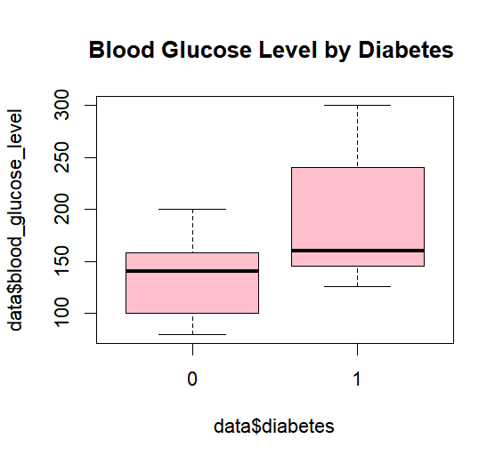

# 🩺 Diabetes Prediction using Machine Learning

A machine learning project for predicting diabetes using patient health records. This project compares multiple classification algorithms and identifies the most suitable model for early diabetes screening.

---

## 📖 Overview

This project develops and compares several machine learning models for predicting diabetes using patient health records. The objective is to identify individuals at high risk of diabetes through data-driven classification, supporting early screening and preventive healthcare.

The study uses a cleaned dataset containing **100,000 patient records** with demographic, lifestyle, and clinical information.

### Machine Learning Models

- Logistic Regression
- Decision Tree
- K-Nearest Neighbors (KNN)

Since the dataset is highly imbalanced (**8.5% diabetic vs 91.5% non-diabetic**), the project focuses on maximizing **Sensitivity (Recall / True Positive Rate)** rather than simply maximizing accuracy.

---

## 📊 Dataset

The dataset contains approximately **100,000 observations** and **8 predictor variables**.

### Features

| Feature | Description |
|---------|-------------|
| Gender | Patient gender |
| Age | Patient age |
| Hypertension | Whether the patient has hypertension |
| Heart Disease | Whether the patient has heart disease |
| Smoking History | Smoking status |
| BMI | Body Mass Index |
| HbA1c Level | Long-term blood glucose indicator |
| Blood Glucose Level | Current blood glucose measurement |

### Target Variable

| Variable | Description |
|----------|-------------|
| Diabetes | 0 = Non-diabetic, 1 = Diabetic |

---

## 🔍 Exploratory Data Analysis

The exploratory analysis reveals several important relationships between patient characteristics and diabetes risk.

| Variable | Observation |
|----------|-------------|
| Age | Older individuals are more likely to have diabetes. |
| Hypertension | Patients with hypertension have significantly higher diabetes prevalence. |
| Heart Disease | Strong positive relationship with diabetes. |
| Smoking History | Smoking history is associated with increased diabetes risk. |
| BMI | Higher BMI corresponds to higher diabetes risk. |
| HbA1c Level | One of the strongest predictors of diabetes. |
| Blood Glucose Level | Most influential predictor with clear separation between classes. |

### Sample Visualizations

#### Diabetes vs Gender


#### Diabetes vs Age


#### Diabetes vs BMI


#### Diabetes vs Blood Glucose



---

## 🤖 Machine Learning Models

Three classification algorithms were developed and evaluated.

| Model | Description |
|------|-------------|
| Logistic Regression | Linear probabilistic classifier |
| Decision Tree | Rule-based non-linear classifier |
| K-Nearest Neighbors (KNN) | Distance-based non-parametric classifier |

---

## ⚙️ Model Training

### Logistic Regression

- All predictors included
- ROC analysis performed
- Optimal threshold selected at **0.2**
- AUC = **0.962**

---

### Decision Tree

- Hyperparameter tuning using Complexity Parameter (cp)

```R
cp_seq <- 10^seq(-6, -1, 1)
```

Best parameter

```text
cp = 0.0001
```

AUC = **0.964**

---

### K-Nearest Neighbors

Numerical variables were standardized before training.

Candidate values

```R
k = seq(1,401,2)
```

Best parameter

```text
k = 39
```

AUC = **0.962**

---

## 📈 Model Performance

| Model | Accuracy | Sensitivity (TPR) | False Positive Rate | AUC |
|------|---------:|------------------:|-------------------:|----:|
| Logistic Regression | 0.939 | 0.766 | 0.045 | 0.962 |
| Decision Tree | 0.964 | 0.744 | 0.016 | 0.964 |
| KNN (k=39) | **0.943** | **0.791** | 0.043 | 0.962 |

---

## 🏆 Best Model

**K-Nearest Neighbors (KNN)** achieved the best overall performance.

### Advantages

- Highest Sensitivity (0.791)
- High AUC (0.962)
- Strong overall prediction ability
- Captures complex non-linear relationships

---

## 📂 Project Structure

```text
Diabetes-Prediction/

│
├── data/
│   └── diabetes-dataset.csv
│
├── diabetes_prediction.R
│
├── images/
│   ├── roc_curve.png
│   ├── decision_tree.png
│   ├── class_distribution.png
│   ├── bmi_boxplot.png
│   └── glucose_boxplot.png
│
├── research_report.pdf
│
├── README.md
│
└── LICENSE
```

---

## 📸 Results

### KNN ROC Curve


---

### Decision Tree


---

## 💻 Technologies Used

| Category | Tools |
|----------|-------|
| Language | R |
| Libraries | tidyverse |
| | caret |
| | class |
| | rpart |
| | pROC |
| | ggplot2 |

---

## 🚀 Future Improvements

- Apply Random Forest
- Apply XGBoost
- Use SMOTE to address class imbalance
- Perform cross-validation
- Explain predictions using SHAP
- Deploy as a Shiny web application

---

## 📚 References

- Charles Elkan (2001). *The Foundations of Cost-Sensitive Learning.*
- Davis & Goadrich (2006). *The Relationship Between Precision-Recall and ROC Curves.*
- Hand (2009). *Measuring Classifier Performance.*
- World Health Organization. *Screening Principles.*

---

## 👨‍💻 Author

**Lu Jianyi**

National University of Singapore (NUS)

Robotics and Machine Intelligence (RMI)

Second Major in Data Analytics
